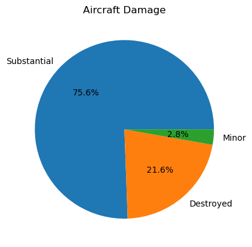

## Overview

This notebook will demonstrate the viability of acquiring and operating aircraft for both private and commercial purposes. By analyzing data from the National Transportation Safety Board (NTSB), we will examine various aircraft incidents and evaluate the associated risks of different types of planes.

## Business Understanding

Our company is looking to expand into the private and commercial sectors of the aviation industry. To evaluate the potential risks of entering these markets, we have analyzed incident and crash data from 1962 to 2023, provided by the NTSB.

Based on this analysis, we have assessed the risks and other key factors that will help us determine which aircraft are best suited to our needs. This assessment takes into account the frequency of crashes across various metrics, the size of the aircraft (inferred from the number of fatalities), and the trends in fatalities over the years.

Using this data, I will present recommendations for initial aircraft purchases as we embark on our expansion into the aviation industry.

## Data Understanding and Analysis

The dataset used is sourced from NTSB (Aviation_Data) which contains records of civil aviation accidents and selected incidents occurred within the United States, its territories and possessions, and in international waters from 1962 to 2023.

The records detail the severity, number of injuries, amount of damage to the aircraft, make and model of the aircraft, location and date of each incident. Other information is provided such as the purpose of flight ,number of engines and weather conditions, which help inform the conditions of each accident or incident.

Data preparation involved dropping null values where needed to obtain a more coherent dataset for analysis. Some steps in formating entries was required as well as dropping duplicates

The data shows there has been a decline in the total number of accidents per year. As seen in the line graph below.

When aircraft do crash, there is a slim chance that the airplane would take minor damage. 
This pie chart shows there is a 97.2% chance that the aircraft would take severe damage in an accident.

Smaller one engine aircraft populate the top 15 aircraft in total accidents. It is worth noting that smaller aircraft are used in training pilots, and although some of these aircraft are incredibly popular there is a significant dip in the of accidents after the Cessna 152 and Cessna 172 airplanes.

The weather conditions drastically increase the chances of an accident. The following plot will show how in two instances whereby the pilots had to rely on readings from their instruments: Instrument Meteorological Conditions and instances where the pilot had better visibility: Visual Meteorological Conditions, and how they impacted the total number of accidents in various aircraft models. A key factor in risk prevention would be extensive training 
of the pilots and crew of the aircraft

This information was gathered by aggregating the instances of airplane accidents and grouping the data by weather conditions.

## Conclusion

We analyzed NTSB data on accidents from 1962 to 2023, uncovering insightful and, at times, predictable patterns in the frequency of airplane incidents and crashes.

* From the distribution of accidents per Year we can see a clear downward trend which indicates airplanes have been getting progressively safer.
* From the Models with the most crashes bar plot we can see two main manufacturers are leading in the total accidents.
Although Cessna and Piper aircraft are involved in the majority of incidents, it is worth mentioning that Cessna 152 and 172 are popular aircraft models used in training novice pilots and this factors into the high frequency of crashes.
* The weather conditions bar plots shows there is a higher frequency of smaller aircraft accidents in conditions with high and low visibility, this may also be attributed to smaller aircraft are more subject to changes in weather even though there may still be other underlying factors that could lead to a crash.

From these insights, it's advisable to: opt for medium to large aircraft - as they are involved in fewer accidents, ensure pilots and crew receive comprehensive training and acquire aircraft featuring cutting-edge technology and systems. These measures would help minimize the risk of major losses and casualties in the event of an accident

Tableau link here: https://public.tableau.com/app/profile/peter.kimani1471/viz/AviationDashboard_17272907301050/Dashboard1?publish=yes